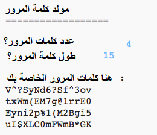

## المقدمة:

من المهم حماية معلوماتك الشخصية على الإنترنت، وفي هذا المشروع ستنشئ برنامجاً لتوليد كلمات المرور لك.

كلمات المرور ستكون عشوائية، لذا لن يتمكن أحد من تخمينها!

  <iframe src="https://trinket.io/embed/python/13fe6a76f7?outputOnly=true&start=result" width="600" height="500" frameborder="0" marginwidth="0" marginheight="0" allowfullscreen>
  </iframe>
  

### معلومات إضافية لقادة النادي

إذا كنت بحاجة إلى طباعة هذا المشروع، فيُرجى استخدام [النسخة القابلة للطباعة](https://projects.raspberrypi.org/ar-SA/projects/password-generator/print).

--- collapse ---
---
title: ملاحظات قادة النادي
---

## مقدمة:

في هذا المشروع ، سوف يتعلم الأطفال ما الذي يجعل كلمة المرور جيدة ، وكيفية إنشاء برنامج يقوم بإنشاء كلمات مرور يتم إنشاؤها بشكل عشوائي.

تمت كتابة هذا المشروع من أجل يوم الإنترنت الآمن 2017 2017 ، وهو في 7 فبراير 2017. الهدف من يوم الإنترنت الآمن هو تعزيز الاستخدام الآمن والمسؤول للتكنولوجيا بالنسبة للشباب. لمزيد من المعلومات ، قم بزيارة [saferinternet.org.uk](https://www.saferinternet.org.uk/) حيث ستجد حزمة تعليمية [للأطفال من سن 7 إلى 11 عامًا ](https://d1afx9quaogywf.cloudfront.net/cdn/farfuture/_-EgL7dYtxtypvvDcNCE53bYE-OMfdH59vaJ5XPcoG4/mtime:1483547665/sites/default/files/SID2017%20Education%20Pack%20for%207-11%20year%20olds_0.zip) تحتوي على موارد إضافية.

## المصادر المتوفرة على الإنترنت

__يستخدم هذا المشروع لغة Python 3.__ نوصي بإستخدام محاكي [trinket](https://trinket.io/) للكتابة بلغة الـ Python عبر الانترنت. يحتوي هذا المشروع على الـ Trinket التالية:

+ [جديد (فارغ) Python Trinket -- jumpto.cc/python-new](http://jumpto.cc/python-new)

هناك أيضًا trinket تحتوي على المشروع المكتمل:

+ [انتهى "إنشاء كلمة المرور" - trinket.io/python/13fe6a76f7](https://trinket.io/python/13fe6a76f7)

## الموارد المتوفرة دون اتصال بالإنترنت
يمكن تطبيق هذا المشروع بشكل كامل [دون اتصال بالانترنت](https://www.codeclubprojects.org/en-GB/resources/python-working-offline/) إن كنت تفضل ذلك.

يمكنك أيضًا العثور على نسخة كاملة من هذا المشروع في قسم "موارد المتطوعين"، الذي يحتوي على:

+ إنشاء كلمة المرور-انتهى/كلمة المرور.py

(جميع الموارد المذكورة أعلاه قابلة للتنزيل أيضًا كملفات `.zip` للمشاريع والمتطوعين)

## أهداف التعلم
+ التكرار;
+ طريقة `random.choice()` ؛

يتناول هذا المشروع عناصر من معايير المناهج الرقمية الخاصة بـ [Raspberry Pi](http://rpf.io/curriculum):

+ [دمج تركيبات البرمجية لحل المشكلة.](https://www.raspberrypi.org/curriculum/programming/builder)

## التحديات
+ "إنشاء كلمة مرور أفضل" - باستخدام <a href="https://howsecureismypassword.net/" target="_blank"> howsecureismypassword.net </a> لإنشاء كلمات مرور آمنة.
+ "استخدام الأرقام وعلامات الترقيم" - إضافة نص إلى متغير حرفي ، مع إعطاء خيار أوسع من الأحرف العشوائية.
+ "كلمة مرور أطول" - تعديل عدد المرات التي يتم فيها اختيار حرف عشوائي.
+ "اختيار عدد كلمات المرور" - باستخدام متغير لتحديد عدد كلمات المرور المطلوبة.

--- /collapse ---

--- collapse ---
---
title: مواد المشروع
---
## موارد المشروع
* [ملف.zip يحتوي على كل موارد المشروع](resources/password-generator-resources.zip)
* [Python Trinket فارغ على الانترنت](http://jumpto.cc/python-new)
* [ملف Python فارغ بدون الاتصال بالانترنت](resources/new-new.py)

## موارد قادة النادي
* [ملف.zip يحتوي على جميع موارد المشروع المكتملة](resources/password-generator-finished.zip)
* [مشروع Trinket المكتمل على الإنترنت](https://trinket.io/python/13fe6a76f7)
* [مشروع مكتمل عبر الإنترنت](resources/password-generator-finished-passwords.py)

--- /collapse ---
