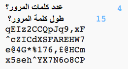

--- challenge ---
## التحدي: إختيار عدد كلمات المرور
بدلاً من طباعة 3 كلمات مرور دائمًا ، هل يمكنك السماح للمستخدم بإدخال عدد كلمات المرور التي يريدها؟

إليك كيفية عمل برنامجك:

التعليمات البرمجية التي ستحتاجها هي __كل __ مماثل للرمز لإدخال `الطول` من كلمة المرور.

--- /challenge ---

***
تمت ترجمة هذا المشروع بواسطة متطوعين:

عيسى أحمد

رائد موسى الجعفري

بفضل المتطوعين ، يمكننا إعطاء الناس في جميع أنحاء العالم فرصة للتعلم بلغتهم الخاصة. يمكنك مساعدتنا في الوصول إلى المزيد من الأشخاص من خلال التطوع للترجمة - مزيد من المعلومات على [rpf.io/translate](https://rpf.io/translate).
