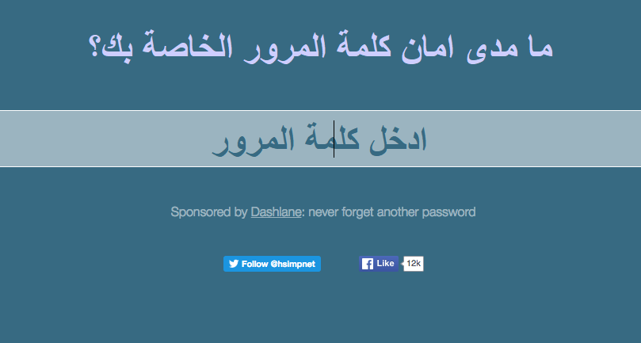
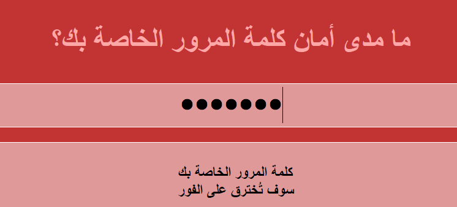

## ما مدى أمان كلمة المرور الخاصة بك؟

يمكن للكمبيوتر محاولة تخمين كلمة المرور الخاصة بك باستخدام "brute force" - وهذا يعني تجربة الكثير من كلمات المرور حتى تخمن كلمة المرور الصحيحة.

دعنا نكتشف كم من الوقت سيستغرق جهاز الكمبيوتر لتخمين كلمة المرور الخاصة بك.

+ انتقل إلى <a href="https://howsecureismypassword.net/" target="_blank"> howsecureismypassword.net </a> ، وهو موقع إلكتروني لمعرفة مدى أمان كلمات المرور الخاصة بك.

    

+ اكتب "letmein" (اسمح لي بالدخول) ككلمة المرور. سترى أن الكمبيوتر سيخمن كلمة المرور هذه __على الفور__!

    

    سترى أيضًا بعض الأسباب التي تجعل "letmein" ليست كلمة مرور جيدة للاستخدام:

    + إنها كلمة مرور __عادية__ (واحدة من كلمات المرور الخمسة عشر الأكثر استخداماً). سوف يخمن الكمبيوتر هذه أولاً.

    + يحتوي على كلمات من القاموس. سيحاول الكمبيوتر أيضًا استخدام كلمات المرور هذه أولاً.

    + إنها قصيرة. سيستغرق الكمبيوتر وقتًا أطول لتخمين كلمة مرور أطول.

    + تحتوي فقط على __حروف__. تكون كلمات المرور أكثر أمانًا إذا كانت تحتوي أيضًا على أرقام وعلامات ترقيم.

+ حاول إدخال كلمة القاموس. كم من الوقت يستغرق الكمبيوتر لتخمين كلمة المرور هذه؟ 

