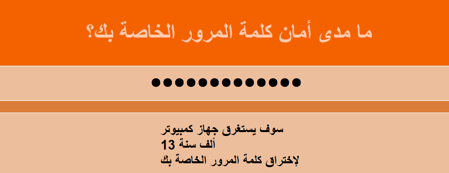

--- challenge ---
## التحدي: إنشاء كلمة مرور أفضل
هل يمكنك إدخال كلمة مرور تستغرق الكمبيوتر أكثر من 1000 عام لإختراقها ولكنها ليست طويلة جدًا للكتابة؟

تذكر أنه من الصعب تخمين كلمة المرور الخاصة بك إذا كانت:

+ طويلة
+ ليست كلمة في القاموس
+ تحتوي على أحرف وأرقام وعلامات ترقيم

ستقوم بإنشاء كلمات مرور يصعب على الكمبيوتر اختراقها. هذه مفيدة لحماية الحسابات الهامة. لاحظ أن العديد من البالغين يستخدمون برنامج إدارة كلمات المرور لمساعدتهم على تذكر الكثير من كلمات المرور الصعبة.

--- /challenge ---