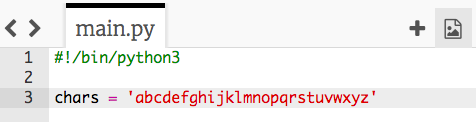
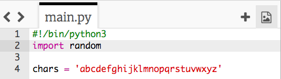

## أحرف عشوائية

لنقم بإنشاء برنامج لاختيار حرف عشوائي لكلمة المرور الخاصة بك.

+ افتح الـ Trinket الذي يحتوي على قالب Python فارغ: <a href="http://jumpto.cc/python-new" target="_blank">jumpto.cc/python-new</a>.
+ أنشئ قائمة بالأحرف ، مخزنة في متغير يسمى `chars`.

    

+ لاختيار حرف عشوائي ، ستحتاج إلى وحدة `import` `random`.

    

+ الآن يمكنك اختيار حرف عشوائي من القائمة ، وتخزينه في متغير يسمى `password`.

    

+ أخيرًا ، يمكنك طباعة كلمة المرور (القصيرة جدًا!) على الشاشة.

    

+ اختبر مشروعك بالنقر فوق "تشغيل". يجب أن تشاهد حرف عشوائي واحد على الشاشة.

    

    إذا قمت بتشغيل البرنامج الخاص بك عدة مرات ، يجب أن تشاهد أحرف مختلفة تظهر.

+ كلمة المرور ليست آمنة للغاية إذا كانت تحتوي على أحرف فقط. أضف بعض الأرقام إلى متغير `chars` الخاص بك.

    

+ اختبر التعليمات البرمجية الخاصة بك مرة أخرى بضع مرات، ويجب أن ترى أنه يتم اختيار رقم في بعض الأحيان.

