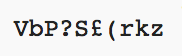

## كلمة مرور عشوائية

الحرف الواحد ليس مفيدًا جدًا - دعنا نحسن برنامجك لإنشاء كلمة مرور أطول.

+ لإنشاء كلمة مرور ، ستضيف إليها أحرفًا عشوائية ، واحدة تلو الأخرى.

    في البداية ، المتغير الخاصة بك `password` يجب أن يكون فارغًا. أضف هذه التعليمات البرمجية إلى برنامجك:

    

+ لإختيار حرف عشوائي 10 مرات. أضف التعليمات البرمجية التالية:

    

+ يجب عليك أيضًا وضع مسافة بادئة (نقل) الخط لاختيار حرف عشوائي ، بحيث يحدث 10 مرات.

    للمسافة البادئة ، اضغط على مفتاح "tab".

    

+ تحتاج إلى استخدام `+ =` لإضافة الحرف الجديد لكلمة المرور في كل مرة.

    

+ اختبر الكود الجديد الخاص بك ويجب أن ترى كلمة مرور بطول 10 أحرف.

    

