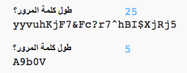

## إختيار طول كلمة المرور

بعض المواقع تتطلب أن تكون كلمات المرور بطول معين. دعونا نسمح للمستخدم باختيار طول كلمة المرور الخاصة به.

+ أولاً ، اطلب من المستخدم إدخال طول كلمة المرور وتخزينها في متغير يسمى `length`.

    

+ استخدم `int ()` لتحويل إدخال المستخدم إلى عدد صحيح.

    

+ استخدم متغير `length` لتكرار عدة مرات كما أدخل المستخدم.

    

+ اختبر التعليمة البرمجية الخاص بك. يجب أن تكون كلمة المرور التي تم إنشاؤها هي الطول الذي أدخله المستخدم.

    

