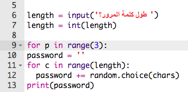
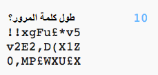

## الكثير من كلمات المرور

دعونا نسمح للمستخدم بإنشاء 3 كلمات مرور مرة واحدة.

+ أضف هذه التعليمة البرمجية لإنشاء 3 كلمات مرور:

    

+ قم بتمييز التعليمات البرمجية الخاصة بإنشاء كلمة مرور ، واضغط على مفتاح Tab للمسافة البادئة بحيث يتكرر 3 مرات.

    

+ اختبر الكود البرمجي الجديد. من المفترض أن ترى الآن 3 كلمات مرور لطول كلمة المرور التي اخترتها.

    

