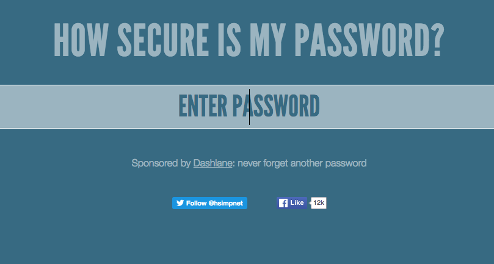
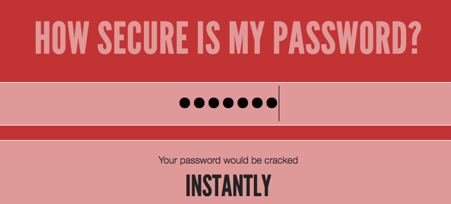

## Hvor sikkert er din adgangskode?

En computer kan prøve at gætte din adgangskode ved at bruge 'brute force' -- dette betyder, at den prøver mange forskellige adgangskoder, indtil den gætter den rigtige.

Lad os finde ud af, hvor længe det vil tage en computer at gætte din adgangskode.

+ Gå til <a href="https://howsecureismypassword.net/" target="_blank">howsecureismypassword.net</a>, som er en hjemmeside brugt til at finde ud af, hvor sikker dine adgangskoder er.

	

+ Skriv "letmein" (Let me in, som betyder luk mig ind) som adgangskoden. Du vil se, at en computer ville gætte denne adgangskode __meget hurtigt__!

	

	Du vil også se, hvorfor "letmein" ikke er god til at bruge som adgangskode:

	+ Det er en adgangskode, som er brugt __rigtig meget__ (en af de 15 mest brugte adgangskoder). En computer ville gætte disse først.

	+ Det indeholder ord fra __ordbogen__. En computer ville også prøve disse adgangskoder først.

	+ Det er meget __kort__. Det ville tage en computer mere tid at gætte en længere adgangskode.

	+ Det indeholder kun __bogstaver__. Adgangskoder er mere sikre, hvis de også indeholder tal og tegnsætninger.

+ Prøv at indtaste et ord fra en ordbog. Hvor lang tid ville det tage en computer at gætte den adgangskode? 

