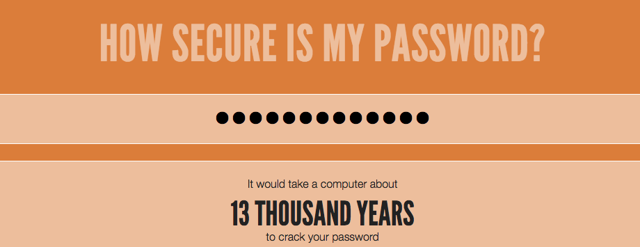

--- challenge ---
## Udfordring: Skabe en bedre adgangskode
Kan du indtaste en adgangskode, der ville tage mere end 1.000 år for computeren at bryde, men som ikke er for lang at skrive?

Husk at din adgangskode er sværere at gætte, hvis den:

+ Er lang
+ Ikke er et ord i ordbogen
+ Indeholder bogstaver, tal, og tegnsætninger

Du kommer til at skabe adgangskoder, som er svære for computeren at gætte. Disse er nyttige til at beskytte vigtige kontoer. Bemærk at mange voksne bruger programmer til styring af adgangskoder til at hjælpe dem med at huske mange, vanskelige adgangskoder.

--- /challenge ---
