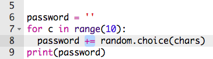

## En tilfældig adgangskode

Et enkelt tegn er ikke særligt brugbart - Lad os forbedre dit program, så det kan skabe en længere adgangskode.

+ For at skabe en adgangskode, skal du tilføje tilfældige tegn til det, en ad gangen.

	Når programmet starter, bør din `password` variabel være tom. Tilføj denne linje til din kode:

	

+ Du vil gerne tilføje et tilfældigt tegn 10 gange. For at gøre dette, tilføj følgende kode:

	

+ Du bør også rykke linjen for at vælge et tilfældigt tegn ind, så det sker 10 gange.

	For at lave indrykning, tryk 'tabulator' tasten (normalt fundet over CAPSLOCK tasten).

	

+ Du er nødt til at bruge `+=`, for at __tilføje__ det nye tegn til adgangskoden hver gang.

	

+ Test din nye kode, og du burde se en adgangskode, der indeholder 10 tegn.

	

