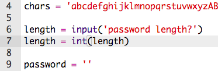
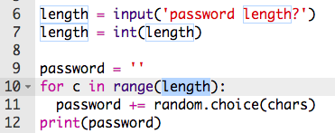

## Vælge længden af adgangskode

Nogle hjemmesider kræver, at adgangskoder er en bestemt længde. Lad os give brugeren mulighed for at vælge længden af deres adgangskode.

+ Først, bed brugeren om at indtaste en længde til adgangskoden, og gem den i en variabel kaldt `length`.

	

+ Brug `int()` til at omdanne brugerens indtastede værdi til et heltal.

	

+ Brug din `length` variabel til at gentage så mange gange som brugeren har indtastet.

	

+ Test din kode. Adgangskoden, der bliver skabt, bør have den længde, brugeren har indtastet.

	

