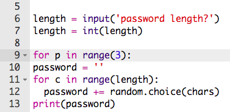
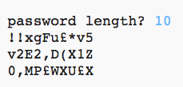

## Mange adgangskoder

Lad os give brugeren mulighed for at kabe 3 adgangskoder på en gang.

+ Tilføj denne kode for at skabee 3 adgangskoder:

	

+ Marker koden, der skaber en adgangskode, og tryk tabulator for at indrykke det. Dette vil få koden til at gentage sig 3 gange.

	

+ Test din nye kode. Du burde nu se 3 adgangskoder med den længde, du har indtastet.

	

