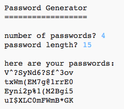

## Einleitung:

Es ist wichtig, deine persönlichen Daten online zu schützen. In diesem Projekt erstellst du ein Programm, um Kennwörter für dich zu generieren.

Die Passwörter werden zufällig sein, so dass niemand sie erraten kann!

  <iframe src="https://trinket.io/embed/python/08c0ad3359?outputOnly=true&start=result" width="600" height="500" frameborder="0" marginwidth="0" marginheight="0" allowfullscreen>
  </iframe>
  

### Zusätzliche Information für Clubleiter

Falls du dieses Projekt ausdrucken möchtest, verwende bitte die [druckfreundliche Version](https://projects.raspberrypi.org/en/projects/password-generator/print).

--- collapse ---
---
title: Anmerkungen für Clubleiter
---

## Einleitung:

In diesem Projekt lernen Kinder, was ein gutes Passwort ausmacht und wie man ein Programm erstellt, das zufällig generierte Passwörter erstellt.

Dieses Projekt wurde für den Safer Internet Day 2017 am 7. Februar 2017 geschrieben. Ziel des Safer Internet Day ist es, den sicheren und verantwortungsvollen Einsatz von Technologie für junge Menschen zu fördern. Für weitere Informationen besuche [saferinternet.org.uk](https://www.saferinternet.org.uk/) wo du ein [Education Pack für 7-11-Jährige](https://d1afx9quaogywf.cloudfront.net/cdn/farfuture/_-EgL7dYtxtypvvDcNCE53bYE-OMfdH59vaJ5XPcoG4/mtime:1483547665/sites/default/files/SID2017%20Education%20Pack%20for%207-11%20year%20olds_0.zip) findest, das zusätzliche Ressourcen enthält.

## Online-Ressourcen

__Dieses Projekt verwendet Python 3.__ Wir empfehlen die Verwendung von [trinket](https://trinket.io/), um Python-Programme online zu schreiben. Dieses Projekt enthält die folgenden Trinkets:

+ [Neues (leeres) Python Trinket - jumpto.cc/python-new](http://jumpto.cc/python-new)

Es gibt auch ein Trinket mit dem fertigen Projekt:

+ ['Password Creator' fertig - trinket.io/python/08c0ad3359](https://trinket.io/python/08c0ad3359)

## Offline-Ressourcen
Dieses Projekt kann, falls gewünscht, auch [offline bearbeitet](https://www.codeclubprojects.org/en-GB/resources/python-working-offline/) werden.

Eine vollständige Version dieses Projekts finden Sie auch im Abschnitt "Ressourcen für freiwillige Mitarbeiter" mit diesem Inhalt:

+ password-creator-finished/passwords.py

(Alle oben genannten Ressourcen können auch als `.zip`-Dateien für Projekte und für Freiwillige heruntergeladen werden.)

## Lernziele
+ Wiederholung;
+ Die `random.choice()` Methode;

Dieses Projekt deckt die folgenden Kernbereiche des [Raspberry Pi Digital Making Curriculum](http://rpf.io/curriculum) ab:

+ [Kombination von verschiedenen Programmierstrukturen um ein Problem zu lösen.](https://www.raspberrypi.org/curriculum/programming/builder)

## Herausforderungen
+ "Ein besseres Passwort erstellen" - mit <a href="https://howsecureismypassword.net/" target="_blank">howsecureismypassword.net</a> sichere Passwörter erstellen.
+ "Benutze Zahlen und Satzzeichen" - Füge Text zu einer String-Variable hinzu, was eine breitere Auswahl an zufälligen Zeichen gibt.
+ "Ein längeres Passwort" - das Ändern der Anzahl der Male, die ein zufälliges Zeichen ausgewählt wird.
+ "Anzahl der Passwörter wählen" - mit Hilfe einer Variable, um die Anzahl der erforderlichen Passwörter festzulegen.

--- /collapse ---

--- collapse ---
---
title: Projektmaterial
---
## Projektressourcen
* [.zip-Datei, die alle Projektressourcen enthält](resources/password-generator-resources.zip)
* [leeres Python-Trinket - online](http://jumpto.cc/python-new)
* [leere Python-Datei - offline](resources/new-new.py)

## Ressourcen für Clubleiter
* [.zip-Datei, die alle fertig gestellten Projektressourcen enthält](resources/password-generator-finished.zip)
* [Vollständiges Trinket-Projekt (online)](https://trinket.io/python/08c0ad3359)
* [Fertiggestelltes Projekt offline](resources/password-generator-finished-passwords.py)

--- /collapse ---
