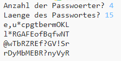

--- challenge ---
## Herausforderung: Anzahl der Passwörter auswählen
Anstatt immer 3 Passwörter anzuzeigen, kannst du dem Benutzer erlauben, die Anzahl der Passwörter einzugeben, die er will?

So sollte dein Programm funktionieren:

Der Code, den du benötigst, ist __sehr__ ähnlich dem Code für die Eingabe der `Länge` des Passworts.

--- /challenge ---