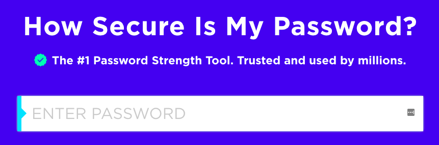

## Wie sicher ist dein Passwort?

Ein Computer könnte versuchen, dein Passwort mit 'brute force' zu erraten. Das bedeutet, viele Passwörter auszuprobieren, bis er das richtige erkennt.

Lass uns herausfinden, wie lange es dauern würde, bis ein Computer dein Passwort errät.

+ Gehe zu <a href="https://howsecureismypassword.net/" target="_blank">howsecureismypassword.net</a>, einer Website, auf der man herausfinden kann, wie sicher deine Passwörter sind.

    

+ Gib "letmein" (Lass mich rein) als Passwort ein. Du wirst sehen, dass ein Computer dieses Passwort __sofort__ erraten würde!

    

    Du wirst auch einige Gründe sehen, warum "letmein" kein gutes Passwort ist:

    + Es ist ein sehr __häufiges__ Passwort (eines der 15 am häufigsten verwendeten Kennwörter). Ein Computer würde diese zuerst erraten.

    + Es enthält Wörter aus dem __Wörterbuch__. Ein Computer würde diese Passwörter auch zuerst ausprobieren.

    + Es ist sehr __kurz__. Ein Computer würde mehr Zeit brauchen, um ein längeres Passwort zu erraten.

    + Es enthält nur __Buchstaben__. Passwörter sind sicherer, wenn sie auch Zahlen und Satzzeichen enthalten.

+ Gib ein Wort aus einem Wörterbuch ein. Wie lange braucht ein Computer, um dieses Passwort zu erraten? 

