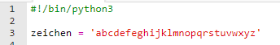
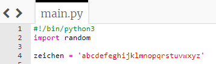
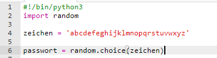
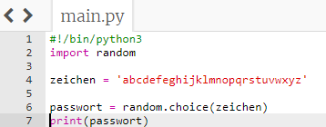
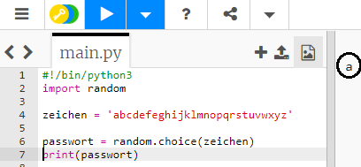
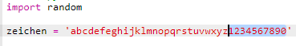

## Zufällige Zeichen

Lass uns ein Programm erstellen, um ein zufälliges Zeichen für dein Passwort zu wählen.

+ Öffne das leere Python-Vorlage-Trinket: <a href="http://jumpto.cc/python-new" target="_blank">jumpto.cc/python-new</a>.
+ Erstelle eine Liste von Zeichen, die in einer Variable mit dem Namen `zeichen ` gespeichert sind.

    

+ Um ein zufälliges Zeichen auszuwählen, musst du das Modul `random` (Zufall) `importieren`.

    

+ Nun kannst du ein zufälliges Zeichen aus der Liste auswählen und es in einer Variable mit dem Namen `passwort` speichern.

    

+ Schließlich kannst du dein (sehr kurzes!) Passwort auf dem Bildschirm ausgeben.

    

+ Teste dein Projekt, indem du auf 'run' klickst. Du solltest ein einzelnes zufälliges Zeichen auf dem Bildschirm sehen.

    

    Wenn du dein Programm ein paar Mal ausführst, solltest du verschiedene Zeichen sehen.

+ Ein Passwort ist nicht sehr sicher, wenn es nur Buchstaben enthält. Füge deiner `zeichen` Variable einige Zahlen hinzu.

    

+ Teste deinen Code ein paar Male, und du solltest sehen, dass manchmal eine Zahl ausgewählt wird.

