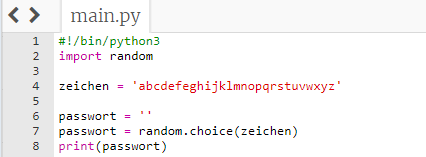
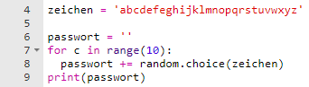
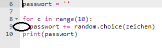
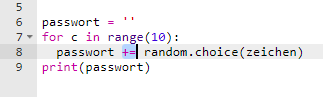

## Ein zufälliges Passwort

Ein einzelnes Zeichen ist nicht sehr nützlich - lass' uns dein Programm verbessern, um ein längeres Passwort zu erstellen.

+ Um ein Passwort zu erstellen, füge zufällige Zeichen nach und nach hinzu.

    Zunächst sollte deine `Passwort` Variable leer sein. Füge deinem Code die folgende Zeile hinzu:

    

+ Du möchtest 10 mal einen zufälliges Zeichen auswählen. Gib hierzu folgenden Code ein:

    

+ Du solltest auch die Zeile einrücken, um ein zufälliges Zeichen auszuwählen, damit es 10 Mal passiert.

    Zum Einrücken drücke die Tab-Taste.

    

+ You need to use `+=` to __add__ the new character to the password each time.

    

+ Test your new code and you should see a password that's 10 characters long.

    

