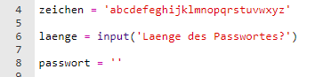
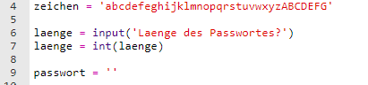
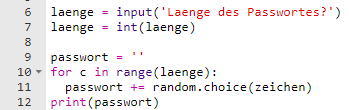
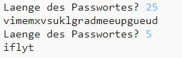

## Wähle eine Passwortlänge

Einige Websites erfordern, dass Passwörter eine bestimmte Länge haben. Lass' uns dem Benutzer erlauben, die Länge seines Passworts zu wählen.

+ Bitte den Benutzer eine Passwortlänge einzugeben, und speichere sie in einer Variable namens `laenge`.

    

+ Verwende `int()` um die Benutzereingabe in eine ganze Zahl umzuwandeln.

    

+ Verwende deine `laenge` Variable um so oft zu wiederholen, wie der Benutzer es eingegeben hat.

    

+ Teste deinen Code. Das erstellte Passwort sollte der vom Benutzer eingegebenen Länge entsprechen.

    

