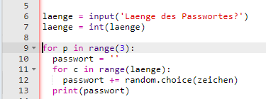
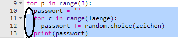
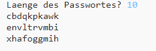

## Viele Passwörter

Erlauben wir dem Benutzer, 3 Passwörter auf einmal zu erstellen.

+ Füge diesen Code hinzu, um 3 Passwörter zu erstellen:

    

+ Markiere den Code zum Erstellen eines Passworts und drücke den Tab zum Einrücken, so dass er 3 Mal wiederholt wird.

    

+ Teste deinen neuen Code. Du solltest nun 3 Passwörter der gewählten Passwortlänge sehen.

    

