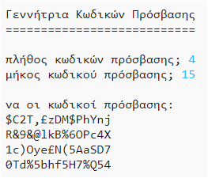

## Εισαγωγή:

Είναι σημαντικό να προστατεύεις τα προσωπικά σου στοιχεία στο Διαδίκτυο. Σε αυτό το έργο θα δημιουργήσεις ένα πρόγραμμα που παράγει κωδικούς πρόσβασης για σένα.

Οι κωδικοί πρόσβασης θα είναι τυχαίοι, οπότε κανείς δε θα μπορεί να τους μαντέψει!

  <iframe src="https://trinket.io/embed/python/a6dc23af9a?outputOnly=true&start=result" width="600" height="500" frameborder="0" marginwidth="0" marginheight="0" allowfullscreen>
  </iframe>
  

### Πρόσθετες πληροφορίες για τους αρχηγούς των ομάδων (clubs)

Αν χρειαστεί να εκτυπώσεις αυτό το έργο, χρησιμοποίησε την [εκτυπώσιμη έκδοση](https://projects.raspberrypi.org/el-GR/projects/password-generator/print).

--- collapse ---
---
title: Σημειώσεις για το/τη συντονιστή/στρια της ομάδας
---

## Εισαγωγή:

Σε αυτό το έργο, τα παιδιά θα μάθουν τι κάνει έναν κωδικό πρόσβασης καλό και πώς θα κάνουν ένα πρόγραμμα που δημιουργεί τυχαίους κωδικούς πρόσβασης.

Αυτό το έργο γράφτηκε για την Ημέρα Ασφαλούς Διαδικτύου 2017, που είναι στις 7 Φεβρουαρίου 2017. Ο στόχος της Ημέρας Ασφαλούς Διαδικτύου είναι η προώθηση της ασφαλούς και υπεύθυνης χρήσης της τεχνολογίας για τους νέους. Για περισσότερες πληροφορίες μπορείς να επισκεφτείς το [saferinternet.org.uk](https://www.saferinternet.org.uk/) όπου θα βρεις ένα πακέτο εκπαίδευσης [για παιδιά ηλικίας 7-11 ετών](https://d1afx9quaogywf.cloudfront.net/cdn/farfuture/_-EgL7dYtxtypvvDcNCE53bYE-OMfdH59vaJ5XPcoG4/mtime:1483547665/sites/default/files/SID2017%20Education%20Pack%20for%207-11%20year%20olds_0.zip) που περιέχει πρόσθετους πόρους.

## Online Πόροι

__Αυτό το έργο χρησιμοποιεί Python 3.__ Συνιστούμε να χρησιμοποιήσεις το [trinket](https://trinket.io/) για να γράψεις Python online. Το έργο αυτό περιλαμβάνει τα ακόλουθα Trinkets:

+ [Νέο (κενό) Python Trinket - jumpto.cc/python-new](http://jumpto.cc/python-new)

Υπάρχει επίσης ένα trinket που περιέχει το τελικό έργο:

+ [Ολοκληρωμένο ‘Password Creator’ -- trinket.io/python/a6dc23af9a](https://trinket.io/python/a6dc23af9a)

## Offline Πόροι
Το έργο αυτό μπορεί να [ολοκληρωθεί χωρίς σύνδεση](https://www.codeclubprojects.org/en-GB/resources/python-working-offline/) αν προτιμάς.

Μπορείς να βρεις το ολοκληρωμένο έργο στο τμήμα «Πόροι εθελοντών», το οποίο περιέχει:

+ password-creator-finish / passwords.py

(Όλοι οι παραπάνω πόροι μπορούν επίσης να κατέβουν ως συμπιεσμένα `.zip` αρχεία.)

## Μαθησιακοί στόχοι
+ Επανάληψη;
+ Η method `random.choice()`˙

Αυτό το έργο καλύπτει στοιχεία από την παρακάτω ενότητα του [Raspberry Pi Digital Curriculum Making](http://rpf.io/curriculum):

+ [Συνδύασε δομές προγραμματισμού για να λύσεις ένα πρόβλημα.](https://www.raspberrypi.org/curriculum/programming/builder)

## Προκλήσεις
+ "Δημιουργία καλύτερου κωδικού πρόσβασης" - χρησιμοποιώντας το <a href="https://howsecureismypassword.net/" target="_blank"> howsecureismypassword.net </a> για να δημιουργήσεις ασφαλείς κωδικούς πρόσβασης.
+ "Χρήση αριθμών και σημείων στίξης" - προσθήκη κειμένου σε μια μεταβλητή τύπου συμβολοσειράς (string), δίνοντας μια ευρύτερη επιλογή από τυχαίους χαρακτήρες.
+ "Ένας κωδικός πρόσβασης με περισσότερους χαρακτήρες" - τροποποιώντας το πλήθος των φορών που επιλέγεται ένας τυχαίος χαρακτήρας.
+ "Επιλογή του πλήθους των κωδικών πρόσβασης" - χρήση μεταβλητής για να καθορίσεις τον απαιτούμενο αριθμό κωδικών πρόσβασης.

--- /collapse ---

--- collapse ---
---
title: Υλικό έργου
---
## Πόροι έργου
* [Το αρχείο.zip περιέχει όλους τους πόρους του έργου](resources/password-generator-resources.zip)
* [Online κενό Python Trinket](http://jumpto.cc/python-new)
* [Offline κενό αρχείο Python](resources/new-new.py)

## Πόροι για τον/την συντονιστή/στρια ομάδας
* [Αρχείο .zip που περιέχει όλους τους ολοκληρωμένους πόρους του έργου](resources/password-generator-finished.zip)
* [Online ολοκληρωμένο έργο Trinket](https://trinket.io/python/a6dc23af9a)
* [Off Ολοκληρωμένο έργο](resources/password-generator-finished-passwords.py)

--- /collapse ---
