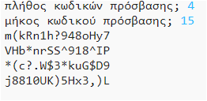

--- challenge ---
## Πρόκληση: Επιλογή του πλήθους των κωδικών πρόσβασης
Αντί να εμφανίζεις πάντα 3 κωδικούς πρόσβασης, μπορείς να επιτρέψεις στο χρήστη να εισάγει το πλήθος των κωδικών πρόσβασης που θέλει;

Έτσι πρέπει να λειτουργεί το πρόγραμμά σου:

Ο κώδικας που θα χρειαστείς είναι __πολύ__ παρόμοιος με τον κώδικα για την εισαγωγή του `μήκους` του κωδικού πρόσβασης.

--- /challenge ---