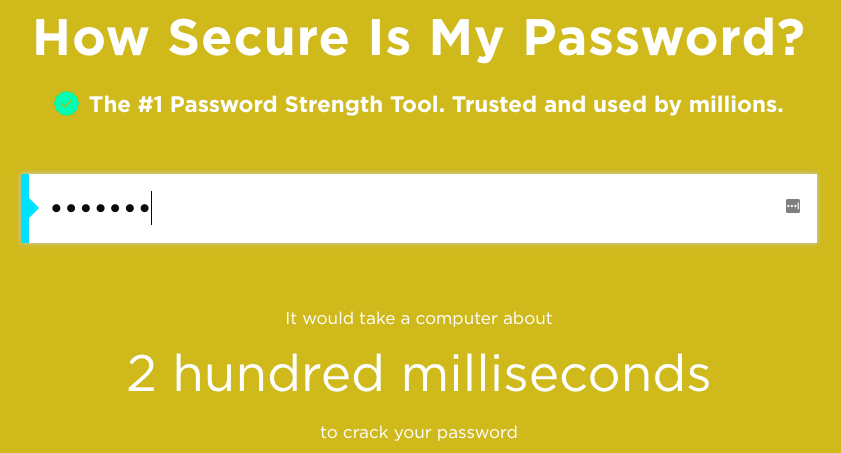

## Πόσο ασφαλής είναι ο δικός σου κωδικός πρόσβασης;

Ένας υπολογιστής θα μπορούσε να προσπαθήσει να μαντέψει τον δικό σου κωδικό πρόσβασης χρησιμοποιώντας το "brute force" - αυτό σημαίνει δοκιμή πολλών κωδικών πρόσβασης μέχρι να μαντέψει τον σωστό.

Ας μάθουμε πόσο χρόνο θα χρειαζόταν ένας υπολογιστής για να μαντέψει τον δικό σου κωδικό πρόσβασης.

+ Πήγαινε στο <a href="https://howsecureismypassword.net/" target="_blank"> howsecureismypassword.net </a>, που είναι ένας ιστότοπος για να μάθεις πόσο ασφαλείς είναι οι δικοί σου κωδικοί πρόσβασης.

    

+ Πληκτρολογήστε "letmein" (Let me in) ως κωδικό πρόσβασης. Θα δεις ότι ένας υπολογιστής θα μαντέψει αμέσως αυτόν τον κωδικό πρόσβασης __ __!

    

    Θα δεις επίσης μερικούς λόγους για τους οποίους το "letmein" δεν είναι ένας καλός κωδικός πρόσβασης για χρήση:

    + Είναι πολύ __ συνηθισμένος__ κωδικός πρόσβασης (ένας από τους 15 κωδικούς πρόσβασης που χρησιμοποιούνται πιο συχνά). Ένας υπολογιστής θα μαντέψει πρώτα αυτούς τους κωδικούς.

    + Περιέχει λέξεις από το λεξικό __ __. Ομοίως, ένας υπολογιστής θα δοκιμάσει πρώτα αυτούς τους κωδικούς πρόσβασης.

    + Είναι πολύ __σύντομος__. Θα χρειαζόταν περισσότερος χρόνος σε έναν υπολογιστή για να μαντέψει έναν μεγαλύτερο κωδικό πρόσβασης.

    + Περιέχει μόνο __γράμματα__. Οι κωδικοί πρόσβασης είναι πιο ασφαλείς εάν περιέχουν επίσης αριθμούς και σημεία στίξης.

+ Δοκίμασε να δώσεις μια λέξη από το λεξικό. Πόσο χρόνο θα χρειαζόταν ένας υπολογιστής για να μαντέψει αυτόν τον κωδικό πρόσβασης; 

