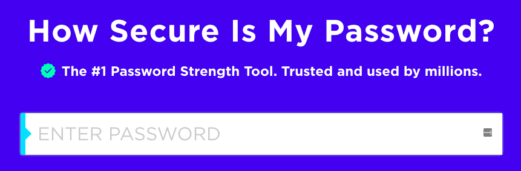

## Πόσο ασφαλής είναι ο δικός σου κωδικός πρόσβασης;

Ένας υπολογιστής θα μπορούσε να προσπαθήσει να μαντέψει τον δικό σου κωδικό πρόσβασης χρησιμοποιώντας το "brute force" - αυτό σημαίνει δοκιμή πολλών κωδικών πρόσβασης μέχρι να μαντέψει τον σωστό.

Ας μάθουμε πόσο χρόνο θα χρειαζόταν ένας υπολογιστής για να μαντέψει τον δικό σου κωδικό πρόσβασης.

+ Go to <a href="https://www.security.org/how-secure-is-my-password/" target="_blank">www.security.org/how-secure-is-my-password/</a>, which is a website for finding out how secure your passwords are.

    

+ Πληκτρολογήστε "letmein" (Let me in) ως κωδικό πρόσβασης. You'll see that a computer would guess this password extremely quickly!

    

    There are some reasons why "letmein" isn't a good password to use:

    + Είναι πολύ __ συνηθισμένος__ κωδικός πρόσβασης (ένας από τους 15 κωδικούς πρόσβασης που χρησιμοποιούνται πιο συχνά). Ένας υπολογιστής θα μαντέψει πρώτα αυτούς τους κωδικούς.

    + Περιέχει λέξεις από το __λεξικό__. Ομοίως, ένας υπολογιστής θα δοκιμάσει πρώτα αυτούς τους κωδικούς πρόσβασης.

    + Είναι πολύ __σύντομος__. Θα χρειαζόταν περισσότερος χρόνος σε έναν υπολογιστή για να μαντέψει έναν μεγαλύτερο κωδικό πρόσβασης.

    + Περιέχει μόνο __γράμματα__. Οι κωδικοί πρόσβασης είναι πιο ασφαλείς εάν περιέχουν επίσης αριθμούς και σημεία στίξης.

+ Δοκίμασε να δώσεις μια λέξη από το λεξικό. Πόσο χρόνο θα χρειαζόταν ένας υπολογιστής για να μαντέψει αυτόν τον κωδικό πρόσβασης; 

