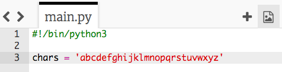

## Τυχαίοι χαρακτήρες

Ας δημιουργήσουμε ένα πρόγραμμα που θα επιλέγει έναν τυχαίο χαρακτήρα για τον δικό σου κωδικό πρόσβασης.

+ Άνοιξε το κενό πρότυπο Python Trinket: <a href="http://jumpto.cc/python-new" target="_blank">jumpto.cc/python-new</a>.
+ Δημιούργησε μια λίστα χαρακτήρων και αποθήκευσέ την σε μια μεταβλητή με όνομα `chars`.

    

+ Για να επιλέξεις έναν τυχαίο χαρακτήρα, θα πρέπει να κάνεις ` import` το module `random`.

    

+ Τώρα μπορείς να επιλέξεις έναν τυχαίο χαρακτήρα από τη λίστα και να τον αποθηκεύσεις σε μια μεταβλητή που ονομάζεται `password`.

    

+ Τέλος, μπορείς να εμφανίσεις τον (πολύ σύντομο!) κωδικό πρόσβασης στην οθόνη.

    

+ Δοκίμασε τον κώδικά σου κάνοντας κλικ στο 'run'. Θα πρέπει να δεις έναν μόνο τυχαίο χαρακτήρα στην οθόνη.

    

    Εάν εκτελέσεις το πρόγραμμά σου μερικές φορές, θα πρέπει να εμφανίζονται διαφορετικοί χαρακτήρες.

+ Ο κωδικός πρόσβασης δεν είναι πολύ ασφαλής εάν περιέχει μόνο γράμματα. Πρόσθεσε μερικούς αριθμούς στη μεταβλητή `chars`.

    

+ Έλεγξε ξανά τον κώδικά σου μερικές φορές και θα πρέπει να δεις ότι μερικές φορές επιλέγεται αριθμός.

