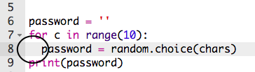

## Τυχαίος κωδικός πρόσβασης

Ένας μεμονωμένος χαρακτήρας δεν είναι πολύ χρήσιμος - ας βελτιώσουμε το πρόγραμμά σου για να δημιουργεί έναν κωδικό πρόσβασης με περισσότερους χαρακτήρες.

+ Για να δημιουργήσεις έναν κωδικό πρόσβασης, θα προσθέσεις τυχαίους χαρακτήρες σε αυτόν, έναν κάθε φορά.

    Αρχικά, η μεταβλητή `password` πρέπει να είναι κενή. Πρόσθεσε αυτήν τη γραμμή στο πρόγραμμά σου:

    

+ Θέλεις να επιλέξεις έναν τυχαίο χαρακτήρα 10 φορές. Για να το κάνεις αυτό, πρόσθεσε τον ακόλουθο κώδικα:

    

+ Πρέπει επίσης να κάνεις εσοχή στη γραμμή για να επιλέξεις έναν τυχαίο χαρακτήρα, έτσι ώστε αυτό να συμβεί 10 φορές.

    Για να δημιουργήσεις εσοχή, πάτησε το πλήκτρο 'tab'.

    

+ Κάθε φορά πρέπει να χρησιμοποιήσεις `+=` για την __προσθήκη__ νέου χαρακτήρα στον κωδικό πρόσβασης.

    

+ Δοκίμασε το νέο σου κώδικα και θα πρέπει να δεις έναν κωδικό πρόσβασης μήκους 10 χαρακτήρων.

    

