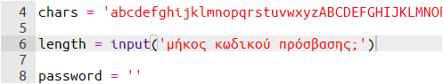
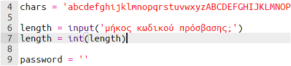
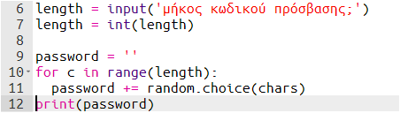
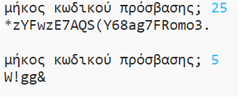

## Επιλέγοντας το μήκος του κωδικού πρόσβασης

Ορισμένοι ιστότοποι απαιτούν κωδικούς πρόσβασης συγκεκριμένου μήκους. Ας επιτρέψουμε στον χρήστη να επιλέξει το μήκος του κωδικού πρόσβασης.

+ Αρχικά, ζήτησε από τον χρήστη να πληκτρολογήσει το μήκος του κωδικού πρόσβασης και αποθήκευσε το σε μια μεταβλητή με όνομα `length`.

    

+ Χρησιμοποίησε την εντολή `int()` για να μετατρέψεις αυτό που πληκτρολόγησε ο χρήστης σε ακέραιο αριθμό.

    

+ Χρησιμοποίησε τη μεταβλητή `length` και κάνε όσες επαναλήψεις ζήτησε ο χρήστης.

    

+ Δοκίμασε τον κώδικά σου. Ο κωδικός πρόσβασης που δημιουργείται πρέπει να έχει το μήκος που έδωσε ο χρήστης.

    

