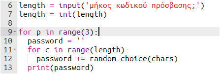
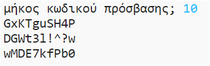

## Πολλοί κωδικοί πρόσβασης

Ας επιτρέψουμε στον χρήστη να δημιουργήσει 3 κωδικούς ταυτόχρονα.

+ Πρόσθεσε αυτόν τον κώδικα για να δημιουργήσεις 3 κωδικούς πρόσβασης:

    

+ Επίλεξε τον κώδικα για τη δημιουργία κωδικού πρόσβασης και πάτησε το πλήκτρο tab για να μπει με εσοχή, έτσι ώστε να επαναληφθεί 3 φορές.

    

+ Δοκίμασε το νέο σου κώδικα. Τώρα θα πρέπει να βλέπεις 3 κωδικούς πρόσβασης με μήκος αυτό που επέλεξες για τους κωδικούς σου.

    

