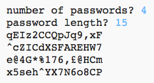

--- challenge ---
## Challenge: Choosing the number of passwords
Instead of always printing 3 passwords, can you allow the user to enter the number of passwords they want?

Here's how your program should work:

The code you'll need is __very__ similar to the code for entering the `length` of the password.

--- /challenge ---