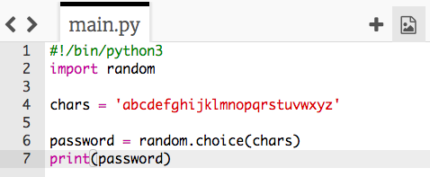
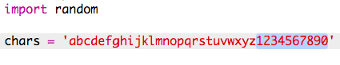

--- challenge ---
## Challenge: Creating a better password
Can you enter a password that would take a computer more than 1,000 years to crack but isn't too long to type?

Remember that your password is harder to guess if it's:

+ Long
+ Not a word in the dictionary
+ Contains letters, numbers and punctuation

You're going to generate passwords that are hard for a computer to crack. These are useful for protecting important accounts. Note that many adults use a password manager program to help them remember lots of tricky passwords.

## Step 2: Random characters

Let's create a program to choose a random character for your password.

+ Open the blank Python template Trinket: <a href="http://jumpto.cc/python-new" target="_blank">jumpto.cc/python-new</a>. 
+ Create a list of characters, stored in a variable called `chars`.

	

+ To choose a random character, you'll need to `import` the `random` module.

	

+ Now you can choose a random character from the list, and store it in a variable called `password`.

	

+ Finally, you can print your (very short!) password to the screen.

	

+ Test your project by clicking 'run'. You should see a single random character on the screen.

	

	If you run your program a few times, you should see different characters appear.

+ A password isn't very secure if it only contains letters. Add some numbers to your `chars` variable.

	

+ Test your code again a few times, and you should see that sometimes a number is chosen.

--- /challenge ---### Additional information for club leaders

If you need to print this project, please use the [Printer friendly version](https://projects.raspberrypi.org/en/projects/password-generator/print).

--- collapse ---
---
title: Club leader notes
---

## Introduction:

In this project, children will learn what makes a good password, and how to make a program that creates randomly generated passwords.

This project has been written for Safer Internet Day 2017, which is on 7th February 2017. The aim of Safer Internet Day is to promote the safe and responsible use of technology for young people. For more information visit [saferinternet.org.uk](https://www.saferinternet.org.uk/) where you'll find an [education pack for 7-11 year-olds](https://d1afx9quaogywf.cloudfront.net/cdn/farfuture/_-EgL7dYtxtypvvDcNCE53bYE-OMfdH59vaJ5XPcoG4/mtime:1483547665/sites/default/files/SID2017%20Education%20Pack%20for%207-11%20year%20olds_0.zip) containing additional resources.

## Online Resources

__This project uses Python 3.__ We recommend using [Trinket](https://trinket.io/) to write Python online. This project contains the following Trinkets:

+ [New (blank) Python Trinket -- jumpto.cc/python-new](http://jumpto.cc/python-new)

There is also a trinket containing the finished project:

+ [‘Password Creator’ Finished -- trinket.io/python/08c0ad3359](https://trinket.io/python/08c0ad3359)

## Offline Resources
This project can be [completed offline](https://www.codeclubprojects.org/en-GB/resources/python-working-offline/) if preferred.

You can find the completed project in the 'Volunteer Resources' section, which contains:

+ password-creator-finished/passwords.py

(All of the resources above are also downloadable as project and volunteer `.zip` files.)

## Learning Objectives
+ Repetition;
+ The `random.choice()` method;

This project covers elements from the following strands of the [Raspberry Pi Digital Making Curriculum](http://rpf.io/curriculum):

+ [Combine programming constructs to solve a problem.](https://www.raspberrypi.org/curriculum/programming/builder)

## Challenges
+ "Creating a better password" - using <a href="https://howsecureismypassword.net/" target="_blank">howsecureismypassword.net</a> to create secure passwords.
+ "Using numbers and punctuation" - adding text to a string variable, giving a wider choice of random characters.
+ "A longer password" - modifying the number of times a random character is chosen.
+ "Choosing the number of passwords" - using a variable to specify the number of passwords required.

--- /collapse ---

--- collapse ---
---
title: Project materials
---
## Project resources
* [.zip file containing all project resources](resources/password-generator-resources.zip)
* [Online blank Python Trinket](http://jumpto.cc/python-new)
* [Offline blank Python file](resources/new-new.py)

## Club leader resources
* [.zip file containing all completed project resources](resources/password-generator-finished.zip)
* [Online completed Trinket project](https://trinket.io/python/08c0ad3359)
* [Offline completed project](resources/password-generator-finished-passwords.py)

--- /collapse ---