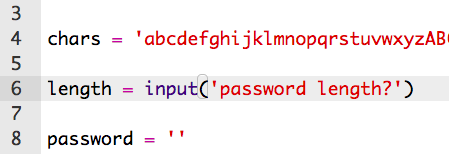
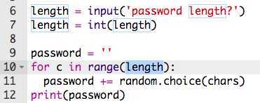

--- challenge ---
## Challenge: A longer password
Can you change your program so that it creates a verrrrrrrry long password?

## Step 4: Choosing a password length

Some websites require passwords to be a certain length. Let's allow the user to choose the length of their password.

+ First, ask the user to input a password length, and store it in a variable called `length`.

	

+ Use `int()` to turn the user's input into a whole number.

	

+ Use your `length` variable to repeat as many times as the user entered.

	

+ Test your code. The password created should be the length entered by the user.

	

## Step 5: Lots of passwords

Let's allow the user to create 3 passwords at once.

+ Add this code to create 3 passwords:

	

+ Highlight the code for creating a password, and press tab to indent so that it repeats 3 times.

	

+ Test your new code. You should now see 3 passwords of your chosen password length.

	

--- /challenge ---