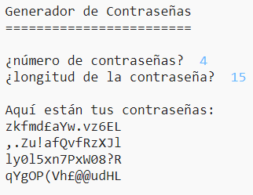

## Introducción:

Es importante proteger tu información personal en línea, y en este proyecto crearás un programa que generará contraseñas para ti.

Las contraseñas serán aleatorias, ¡así que nadie podrá adivinarlas!

  <iframe src="https://trinket.io/embed/python/f3086bbf35?outputOnly=true&start=result" width="600" height="500" frameborder="0" marginwidth="0" marginheight="0" allowfullscreen>
  </iframe>
  

### Información adicional para líderes de club

Si necesitas imprimir este proyecto, usa la [Versión para imprimir](https://projects.raspberrypi.org/es-ES/projects/password-generator/print).

--- collapse ---
---
title: Notas del líder del club
---

## Introducción:

En este proyecto, los niños aprenderán lo que hace una buena contraseña, y cómo hacer un programa que cree contraseñas generadas al azar.

Este proyecto fue escrito para el Día de Internet más Seguro 2017, que fue el 7 de febrero de 2017. El objetivo del Día por un Internet más seguro es promover el uso seguro y responsable de la tecnología por parte de la gente joven. Para más información visita [saferinternet.org.uk](https://www.saferinternet.org.uk/) donde encontrarás un [paquete de educación para niños de 7-11 años](https://d1afx9quaogywf.cloudfront.net/cdn/farfuture/_-EgL7dYtxtypvvDcNCE53bYE-OMfdH59vaJ5XPcoG4/mtime:1483547665/sites/default/files/SID2017%20Education%20Pack%20for%207-11%20year%20olds_0.zip) que contiene recursos adicionales.

## Recursos en línea

__Este proyecto usa Python 3.__ Recomendamos el uso de [Trinket](https://trinket.io/) para escribir Python en línea. Este proyecto contiene los siguientes Trinkets:

+ [Trinket nuevo (en blanco) -- jumpto.cc/python-new](http://jumpto.cc/python-new)

También hay un Trinket con el proyecto acabado:

+ [‘Generador de Contraseñas’ Terminado -- trinket.io/python/f3086bbf35](https://trinket.io/python/f3086bbf35)

## Recursos sin conexión
Este proyecto se puede [completar sin conexión](https://www.codeclubprojects.org/en-GB/resources/python-working-offline/) si se prefiere.

También se puede encontrar una versión completa de este proyecto en la sección 'Recursos para voluntarios', que contiene:

+ password-creator-finished/passwords.py

(Todos los recursos anteriores también se pueden descargar como archivos `.zip` de proyectos y para voluntarios.)

## Objetivos del Aprendizaje
+ Repetición;
+ El método `random.choice()`;

Este proyecto trata elementos de los siguientes aspectos del [Currículo de creación digital de Raspberry Pi](http://rpf.io/curriculum):

+ [Combinar estructuras de programación para resolver un problema.](https://www.raspberrypi.org/curriculum/programming/builder)

## Desafíos
+ "Creando una contraseña mejor" - usando <a href="https://howsecureismypassword.net/" target="_blank"> howsecureismypassword.net </a> para crear contraseñas seguras.
+ "Usar números y signos de puntuación" - agregar texto a una variable de tipo cadena y ofrecer una mayor variedad de caracteres aleatorios.
+ "Una contraseña más larga" - modificar la cantidad de veces que se elige un carácter aleatorio.
+ "Eligiendo el número de contraseñas" - usar una variable para especificar el número de contraseñas requeridas.

--- /collapse ---

--- collapse ---
---
title: Materiales del proyecto
---
## Recursos del proyecto
* [archivo .zip que contiene todos los recursos del proyecto](resources/password-generator-resources.zip)
* [Trinket Python en blanco en línea](http://jumpto.cc/python-new)
* [Trinket Python en blanco sin conexión](resources/new-new.py)

## Recursos para el líder del club
* [archivo .zip que contiene todos los recursos del proyecto](resources/password-generator-finished.zip)
* [Proyecto Trinket terminado en línea](https://trinket.io/python/f3086bbf35)
* [Proyecto completado sin conexión](resources/password-generator-finished-passwords.py)

--- /collapse ---
