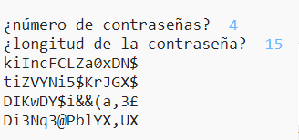

--- challenge ---
## Desafío: elegir el número de contraseñas
En lugar de imprimir siempre 3 contraseñas, ¿puede hacer que el usuario introduzca el número de contraseñas que desee?

Aquí tienes como debería funcionar el programa:

El código que necesitarás es __muy__ similar al código para introducir la `longitud` de la contraseña.

--- /challenge ---

***
Este proyecto fue traducido por voluntarios:

José María Honrado

Laura Lurati

Gracias a los voluntarios, podemos dar a las personas de todo el mundo la oportunidad de aprender en su propio idioma. Puede ayudarnos a llegar a más personas ofreciéndose como voluntario para traducir; más información en [rpf.io/translate](https://rpf.io/translate).