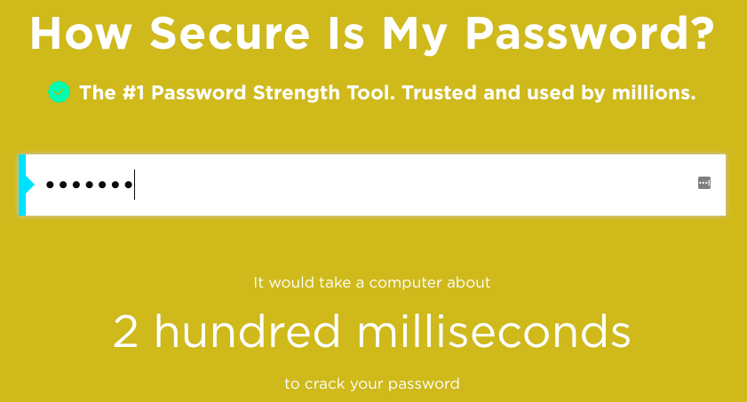

## ¿Como es de segura tu contraseña?

Un ordenador podría intentar adivinar tu contraseña usando 'fuerza bruta' -- esto significa probar muchas contraseñas hasta que se adivine la correcta.

Vamos a averiguar cuánto tardaría un ordenador en adivinar tu contraseña.

+ Ve a <a href="https://howsecureismypassword.net/" target="_blank">howsecureismypassword.net</a>, que es un sitio web para conocer la seguridad de tus contraseñas.

    

+ Escribe "letmein" (Déjame entrar) como contraseña. ¡Verás que un ordenador adivinaría esta contraseña __instantáneamente__!

    

    También verás algunas de las razones por las que "letmein" no es una buena contraseña para utilizar:

    + Es una contraseña muy __común__ (una de las 15 contraseñas más utilizadas. Nota: en inglés). Un ordenador las adivinaría primero.

    + Contiene palabras del __diccionario__. Un ordenador también intentaría estas contraseñas primero.

    + Es muy __corta__. Le llevaría más tiempo a un ordenador adivinar una contraseña más larga.

    + Sólo contiene __letras__. Las contraseñas son más seguras si también contienen números y signos de puntuación.

+ Intenta introducir una palabra del diccionario. ¿Cuánto tiempo tardaría un ordenador en adivinar esa contraseña? 

