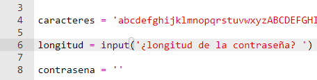
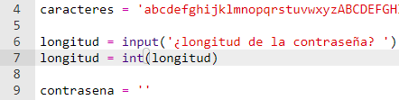
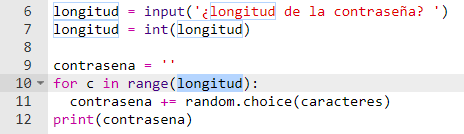
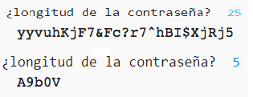

## Escogiendo una longitud para la contraseña

Algunos sitios web requieren que las contraseñas tengan una cierta longitud. Permitamos que el usuario elija la longitud de su contraseña.

+ Primero, pide al usuario que introduzca una longitud para la contraseña y almacenalá en una variable llamada `longitud`.

    

+ Usa `int()` para convertir la entrada del usuario en un número entero.

    

+ Usa tu variable `longitud` para repetir el proceso tantas veces como lo haya indicado el usuario.

    

+ Prueba tu código. La contraseña creada debe tener la longitud especificada por el usuario.

    

