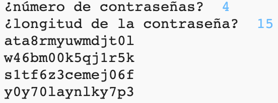

--- challenge ---
## Desafío: Eligiendo el número de contraseñas
En lugar de imprimir siempre 3 contraseñas, ¿puedes hacer que el usuario introduzca el número de contraseñas que desee generar?

Así es como debería funcionar tu programa:

El código que necesitarás es __muy__ similar al código para introducir la `longitud` de la contraseña.

--- /challenge ---