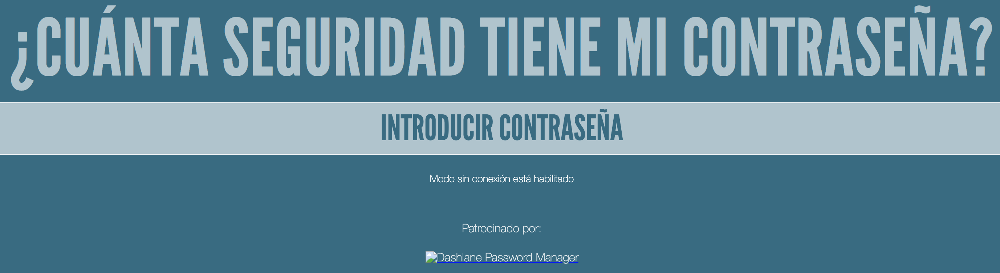
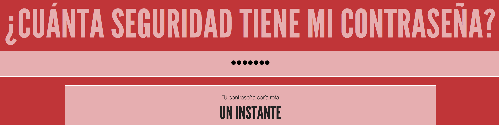

## ¿Qué tan segura es tu contraseña?

Una computadora podría intentar adivinar tu contraseña usando 'fuerza bruta' -- esto significa probar muchas contraseñas hasta que adivine la correcta.

Veamos cuánto tiempo le tomaría a una computadora adivinar tu contraseña.

+ Ve a <a href="https://howsecureismypassword.net/" target="_blank">howsecureismypassword.net</a>, que es un sitio web para descubrir qué tan seguras son sus contraseñas.

    

+ Escribe "letmein" (Déjame entrar en inglés) como contraseña. Verás que una computadora adivinará esta contraseña en ¡__un instante__!

    

    También verás algunas de las razones por las que "letmein" no es una buena contraseña para utilizar:

    + Es una contraseña muy __común__ (una de las 15 contraseñas más utilizadas). Una computadora adivinaría esto primero.

    + Contiene palabras del __diccionario__. Una computadora también probaría estas contraseñas primero.

    + Es muy __corta__. Le llevaría más tiempo a una computadora adivinar una contraseña más larga.

    + Sólo contiene __letras__. Las contraseñas son más seguras si también contienen números y signos de puntuación.

+ Intenta ingresando una palabra del diccionario. ¿Cuánto tiempo le tomaría a una computadora adivinar esa contraseña? 

