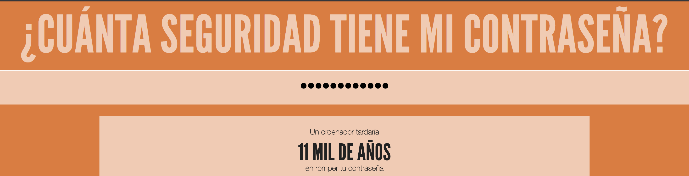

--- challenge ---
## Desafío: Creando una mejor contraseña
¿Puedes ingresar una contraseña que una computadora demoraría más de 1,000 años en descifrar, pero que no es demasiado larga para escribir?

Recuerda que tu contraseña es más difícil de adivinar si es:

+ Larga
+ No es una palabra que este en el diccionario
+ Contiene letras, números y signos de puntuación

Vas a generar contraseñas que son difíciles de descifrar para una computadora. Son útiles para proteger cuentas importantes. Ten en cuenta que muchos adultos usan un programa de administración de contraseñas para ayudarlos a recordar muchas contraseñas difíciles.

--- /challenge ---