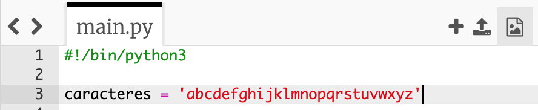

## Caracteres aleatorios

Creemos un programa para elegir un carácter aleatorio para tu contraseña.

+ Abre la plantilla Python en blanco en Trinket: <a href="http://jumpto.cc/python-new" target="_blank">jumpto.cc/python-new</a>.
+ Crea una lista de caracteres y almacénalos en una variable llamada `caracteres`.

    

+ Para elegir un carácter aleatorio, tendrás que importar `import` el módulo `random`.

    

+ Ahora puedes elegir un carácter aleatorio de la lista y almacenarlo en una variable llamada `contrasena` (Nota: Trinket no reconoce la ñ como carácter válido para usar en variables).

    

+ Por último, puedes imprimir la contraseña (¡muy corta!) en la pantalla.

    

+ Prueba tu proyecto haciendo clic en 'Run'. Deberías ver un solo carácter, elegido de forma aleatoria, en la pantalla.

    

    Si ejecutas tu programa varias veces, deberías ver aparecer diferentes caracteres.

+ Una contraseña no es muy segura si solo contiene letras. Añade algunos números a tu variable `caracteres`.

    

+ Prueba tu código de nuevo un par de veces, y deberías ver que a veces aparece un número.

