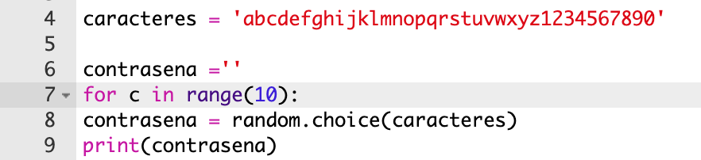

## Una contraseña aleatoria

Un solo carácter no es muy útil - mejoremos el programa para crear una contraseña más larga.

+ Para crear una contraseña, se añadirán caracteres aleatorios, uno a la vez.

    Para empezar, tu variable `contrasena` debe estar vacía. Añade esta línea a tu código:

    

+ Supongamos que quieres elegir un carácter aleatorio 10 veces. Para hacer esto, agrega el siguiente código:

    

+ También deberías insertar una sangría (mover dentro) la línea de código donde se elige un carácter aleatorio, de modo que ocurra 10 veces.

    Para insertar una sangraría, presione la tecla 'tab'.

    

+ Necesitas usar `+=` para __agregar__ el nuevo carácter a la contraseña cada vez.

    

+ Prueba tu nuevo código y deberías ver una contraseña de 10 caracteres.

    

