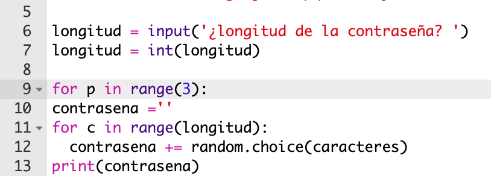
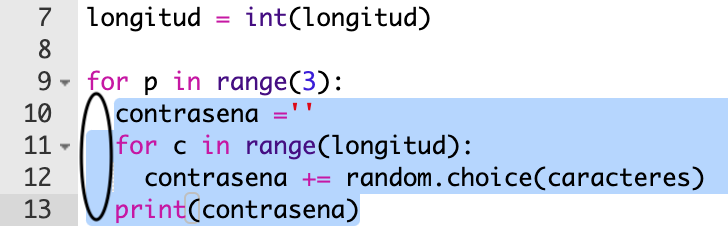
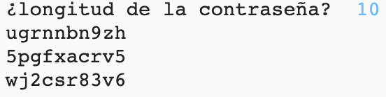

## Muchas contraseñas

Permitamos que el usuario cree 3 contraseñas a la vez.

+ Agrega este código para crear 3 contraseñas:

    

+ Resalta el código para crear una contraseña, y presiona tabulador para insertar una sangría y hacer que se repita 3 veces.

    

+ Prueba tu nuevo código. Ahora deberías ver 3 contraseñas de la longitud elegida.

    

