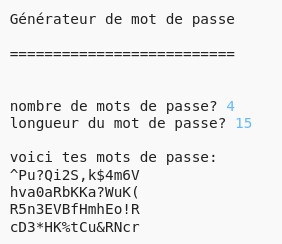

## Introduction :

Il est important de protéger tes informations personnelles en ligne, et dans ce projet, tu vas créer un programme pour générer des mots de passe pour toi.

Les mots de passe seront aléatoires, donc personne ne pourra les deviner !

  <iframe src="https://trinket.io/embed/python/d8317d4646?outputOnly=true&start=result" width="600" height="500" frameborder="0" marginwidth="0" marginheight="0" allowfullscreen>
  </iframe>
  

### Informations complémentaires pour les responsables de club

Si vous avez besoin d'imprimer ce projet, merci d'utiliser la [version imprimable](https://projects.raspberrypi.org/fr-FR/projects/password-generator/print).

--- collapse ---
---
title: Notes pour le responsable de club
---

## Introduction :

Dans ce projet, les enfants apprendront ce qui fait un bon mot de passe et comment faire un programme qui crée des mots de passe générés aléatoirement.

Ce projet a été écrit pour la Journée Safer Internet 2017, qui est le 7 février 2017. L'objectif de la Journée Safer Internet est de promouvoir une utilisation sûre et responsable de la technologie pour les jeunes. Pour plus d'informations, visitez [saferinternet.org.uk](https://www.saferinternet.org.uk/) où vous trouverez un [pack d'éducation pour 7-11 ans](https://d1afx9quaogywf.cloudfront.net/cdn/farfuture/_-EgL7dYtxtypvvDcNCE53bYE-OMfdH59vaJ5XPcoG4/mtime:1483547665/sites/default/files/SID2017%20Education%20Pack%20for%207-11%20year%20olds_0.zip) contenant des ressources supplémentaires.

## Ressources en ligne

__Ce projet utilise Python 3.__ Nous vous recommandons d'utiliser [Trinket](https://trinket.io/) pour écrire du code Python en ligne. Ce projet contient les Trinkets suivants :

+ [Nouveau Trinket Python (vierge) -- jumpto.cc/python-new](http://jumpto.cc/python-new)

Il existe aussi un trinket qui contient le projet terminé :

+ [« Créateur de mot de passe » terminé -- trinket.io/python/d8317d4646](https://trinket.io/python/d8317d4646)

## Ressources hors-ligne
Ce projet peut être [terminé hors-ligne](https://www.codeclubprojects.org/en-GB/resources/python-working-offline/) si désiré.

Vous pouvez aussi trouver une version terminée du projet dans la section « Ressources du bénévole » qui contient :

+ password-creator-finished/passwords.py

(Toutes les ressources ci-dessus peuvent aussi être téléchargées dans les fichiers`.zip` projet et bénévole)

## Objectifs d'apprentissage
+ Répétition ;
+ La méthode `random.choice()` ;

Ce projet couvre les éléments suivants du [Programme de Créativité Numérique de Raspberry Pi](http://rpf.io/curriculum) :

+ [Combiner des constructions de programmation pour résoudre un problème.](https://www.raspberrypi.org/curriculum/programming/builder)

## Défis
+ « Créer un meilleur mot de passe » - en utilisant <a href="https://howsecureismypassword.net/" target="_blank">howsecureismypassword.net</a> pour créer des mots de passe sécurisés.
+ « Utilisation des nombres et de la ponctuation » : ajout de texte à une variable chaîne de caractères, donnant un choix plus large de caractères aléatoires.
+ « Un mot de passe plus long » - modifier le nombre de fois qu'un caractère aléatoire est choisi.
+ « Choisir le nombre de mots de passe » - en utilisant une variable pour spécifier le nombre de mots de passe requis.

--- /collapse ---

--- collapse ---
---
title: Matériaux du projet
---
## Ressources du projet
* [Fichier .zip contenant toutes les ressources du projet](resources/password-generator-resources.zip)
* [Trinket Python en ligne vierge](http://jumpto.cc/python-new)
* [Fichier Python hors-ligne vierge](resources/new-new.py)

## Ressources pour le responsable de club
* [Fichier .zip contenant toutes les ressources du projet](resources/password-generator-finished.zip)
* [Trinket Python en ligne terminé](https://trinket.io/python/d8317d4646)
* [Projet terminé hors-ligne](resources/password-generator-finished-passwords.py)

--- /collapse ---
