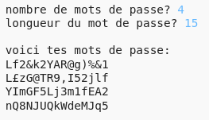

--- challenge ---
## Défi : choisir le nombre de mots de passe
Au lieu d'imprimer toujours 3 mots de passe, peux-tu autoriser l'utilisateur à entrer le nombre de mots de passe qu'il souhaite ?

Voici comment ton programme devrait fonctionner :

Le code dont tu auras besoin est __ très __ similaire au code pour saisir la ` longueur` du mot de passe.

--- /challenge ---