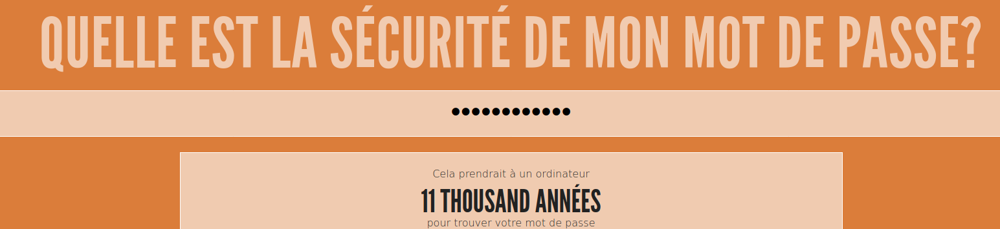

--- challenge ---
## Défi : créer un meilleur mot de passe
Peux-tu entrer un mot de passe qui prendrait plus de 1 000 ans à un ordinateur pour le déchiffrer mais qui n'est pas trop long à taper ?

N'oublie pas que ton mot de passe est plus difficile à deviner si c'est :

+ Long
+ Pas un mot du dictionnaire
+ Contient des lettres, des chiffres et de la ponctuation

Tu vas générer des mots de passe qui sont difficiles à déchiffrer pour un ordinateur. Ils sont utiles pour protéger les comptes importants. Note que de nombreux adultes utilisent un programme de gestion de mots de passe pour les aider à se souvenir de beaucoup de mots de passe délicats.

--- /challenge ---