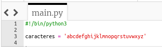
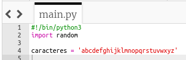
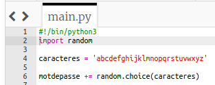
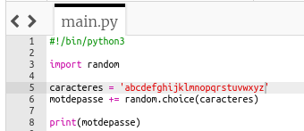
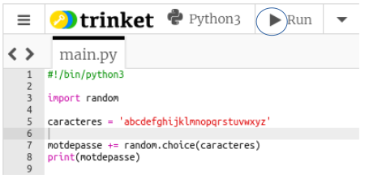
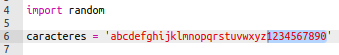

## Caractères aléatoires

Créons un programme pour choisir un caractère aléatoire pour ton mot de passe.

+ Ouvre le modèle de Trinket Python vierge : <a href="http://jumpto.cc/python-new" target="_blank">jumpto.cc/python-new</a>.
+ Crée une liste de caractères, stockés dans une variable appelée `caracteres`.

    

+ Pour choisir un caractère aléatoire, tu devras `importer` le module `random`.

    

+ Tu peux maintenant choisir un caractère aléatoire dans la liste, et le stocker dans une variable appelée `motdepasse`.

    

+ Enfin, tu peux imprimer ton mot de passe (très court !) à l'écran.

    

+ Teste ton projet en cliquant sur « exécuter». Tu devrais voir un seul caractère aléatoire à l'écran.

    

    Si tu exécutes ton programme à plusieurs reprises, tu devrais voir apparaître différents caractères.

+ Un mot de passe n'est pas très sûr s'il ne contient que des lettres. Ajoute quelques chiffres à ta variable `caracteres`.

    

+ Teste ton code à nouveau quelques fois, et tu devrais voir que parfois un nombre est choisi.

