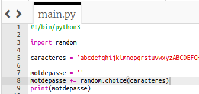
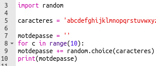
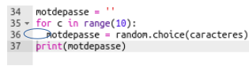
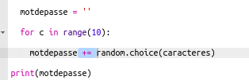

## Un mot de passe aléatoire

Un seul caractère n'est pas très utile - améliorons ton programme pour créer un mot de passe plus long.

+ Pour créer un mot de passe, tu y ajouteras des caractères aléatoires, un à la fois.

    Pour commencer, ta variable `motdepasse` doit être vide. Ajoute cette ligne à ton code :

    

+ Tu veux choisir un caractère aléatoire 10 fois. Pour faire cela, ajoute le code suivant :

    

+ Tu devras également indenter (déplacer) la ligne pour choisir un caractère aléatoire, afin que cela se produise 10 fois.

    Pour indenter, appuie sur la touche « tab ».

    

+ Tu dois utiliser `+=` pour __ajouter__ le nouveau caractère au mot de passe à chaque fois.

    

+ Teste ton nouveau code et tu devrais voir un mot de passe de 10 caractères.

    

