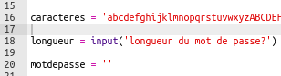
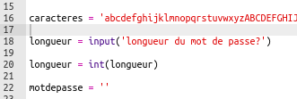
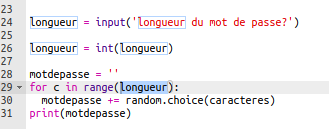
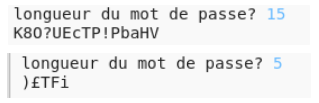

## Choisir une longueur de mot de passe

Certains sites Web exigent que les mots de passe soient d'une certaine longueur. Permettons à l'utilisateur de choisir la longueur de son mot de passe.

+ Tout d'abord, demande à l'utilisateur de saisir une longueur de mot de passe et stocke-la dans une variable appelée `longueur`.

    

+ Utilise `int()` pour transformer la saisie de l'utilisateur en un nombre entier.

    

+ Utilise ta variable `longueur` pour répéter autant de fois que l'utilisateur l'a entré.

    

+ Teste ton code. Le mot de passe créé doit être la longueur saisie par l'utilisateur.

    

