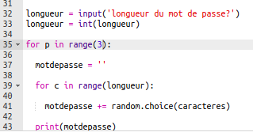
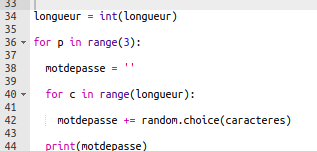
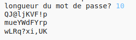

## Beaucoup de mots de passe

Permettons à l'utilisateur de créer 3 mots de passe à la fois.

+ Ajoute ce code pour créer 3 mots de passe :

    

+ Mets en surbrillance le code de création d'un mot de passe et appuie sur tab pour l'indenter afin qu'il se répète 3 fois.

    

+ Teste ton nouveau code. Tu devrais maintenant voir 3 mots de passe de la longueur choisie.

    

