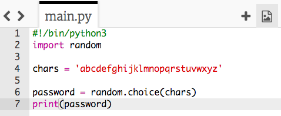
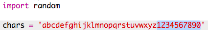

## अनोखे करैक्टर्स (random characters)

आइए अपने पासवर्ड के लिए अनोखे करैक्टर्स (random characters) चुनने के लिए एक प्रोग्राम बनाएं।

+ Trinket मे खाली Python टेंपलेट(template) खोलें: <a href="http://jumpto.cc/python-new" target="_blank"> jumpto.cc/python-new </a>.
+ करैक्टर्स (characters) की एक सूची बनाएं, जिसे एक वेरिएबल(variable) में सेव किया जाता है जिसे ` chars ` कहा जाता है।

    

+ अनोखे करैक्टर्स (random characters) चुनने के लिए, आपको ` random ` module` import ` करना होगा।

    

+ अब आप सूची से एक अनोखा करैक्टर(random character) चुन सकते हैं, और इसे एक वेरिएबल(variable) में सेव करे जिसे` पासवर्ड(password) ` कहते है।

    

+ आखिरकार, आप स्क्रीन पर अपना (बहुत छोटा!) पासवर्ड प्रिंट कर सकते हैं।

    

+ Run पर क्लिक करके अपने कोड का परीक्षण(Test) करें । आपको स्क्रीन पर अकेला अनोखा करैक्टर(random character) दिखना चाहिए।

    

    यदि आप अपना प्रोग्राम कुछ बार चलाते हैं, तो आपको अलग-अलग करैक्टर्स (characters) दिखाई देगें।

+ एक पासवर्ड बहुत सुरक्षित नहीं है अगर उसमें केवल अक्षर(Letters) हैं। अपने ` chars` वेरिएबल(variable) में कुछ संख्याएँ(numbers) जोडे ।

    

+ अपने कोड को कुछ बार फिर से परीक्षण(Test) करें, और आप देख सकते है कि कभी-कभी संख्या(number) चुनी जाती है।

