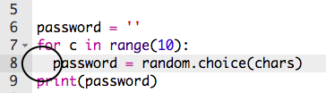

## एक अनोखा पासवर्ड

एकमात्र करैक्टर(character) बहुत उपयोगी नहीं है - एक लंबा पासवर्ड बनाने के लिए अपने प्रोग्राम में सुधार करें।

+ एक पासवर्ड बनाने के लिए, आप को एक बार में एक अनोखा करैक्ट(random characters) जोड़ना होगा।

    शुरू करने के लिए, आपका ` password ` वेरिएबल(variable) खाली होना चाहिए। इस लाइन को अपने कोड में जोड़ें:

    

+ आपको 10 बार अनोखे करैक्टर्स (random characters) चुनने हैं। ऐसा करने के लिए, निम्न कोड जोड़ें:

    

+ आपकोअनोखे करैक्टर्स (random characters) का चयन करने के लिए लाइन को भी indent करना (स्थानांतरित करना) चाहिए, ताकि ऐसा 10 बार हो।

    Indent करने के लिए Tab key दबाएं।

    

+ हर बार पासवर्ड के लिए नया करैक्टर (character) __ जोड़ने__ के लिये आपको ` + = `का उपयोग करने की जरुरत है ।

    

+ अपने नए कोड का परीक्षण(Test) करें और आपको एक पासवर्ड दिखाई देंगा जो 10 करैक्टर्स (characters) लंबा होगा।

    

